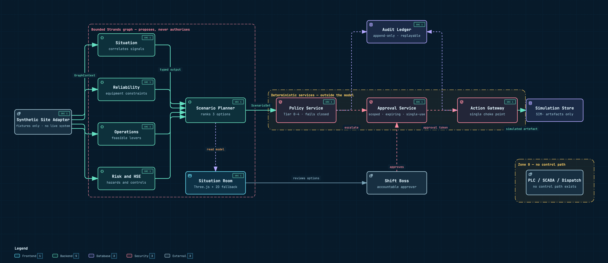

# CAIRN

## Mine Operations Decision Fabric

CAIRN is a governed enterprise agent for mining operations. It correlates fragmented operational signals into a single incident, coordinates specialist analysis, proposes evidence-backed recovery options, obtains accountable human approval, and records the resulting actions and outcomes.

The first vertical slice is **compound-disruption recovery during an open-pit mine shift**, implemented with Python, the Strands Agents SDK, synthetic mine events, and a simulation-only action gateway.

> **Simulation only.** Every event, asset and artefact in this repository is synthetic. No mine system, PLC, SCADA, dispatch, ERP or CMMS is connected, and no cloud credentials are required to run the demo.

---

## Quick start

Requires Python 3.12 and [uv](https://docs.astral.sh/uv/). No Node, no build step, no AWS account.

```bash
git clone https://github.com/jwlai-cloud/cairn.git
cd cairn

uv python install 3.12
uv venv --python 3.12
source .venv/bin/activate          # Windows: .venv\Scripts\activate
uv pip install -e ".[dev]"

uvicorn app.api.main:app --port 8000
```

Open <http://127.0.0.1:8000>.

### Run the tests

```bash
source .venv/bin/activate
python -m pytest -q                # 72 tests
python -m pytest tests/safety -q   # safety cases only
```

---

## The three-minute demo path

Every button is in the footer of the situation room. The scenario is deterministic: the same clicks always produce the same incident, the same options and the same audit chain.

| # | Click | What to point at |
|---|---|---|
| 1 | — | Normal shift. KPI strip shows 8,200 t against a 12,000 t target, 8 trucks, no alerts. |
| 2 | **Inject all** | Five signals arrive on the timeline from four different systems. |
| 3 | **Run analysis** | Four specialist agents run in parallel, then the scenario planner. Five signals become **one incident**, not five alerts. Stale and conflicting evidence is called out, not resolved away. |
| 4 | Click a scenario card | Route overlays and affected assets update in the scene. Closed routes go grey and dashed. |
| 5 | **Attempt interlock override** | Deterministic policy denial with rule ID, tier and `decidedBy: deterministic policy service (no model call)`. **The model can recommend; it cannot authorise.** |
| 6 | **Request approval** | Policy escalates. A scoped, expiring approval is created for the named role. |
| 7 | **Approve as SHIFT_BOSS** | A server-issued approval token is bound to the plan version and the evidence hash. |
| 8 | **Execute simulated action** | `SIM-` prefixed work order and shift instruction, each with an idempotency key. |
| 9 | **Verify outcome** | Projected tonnes and crusher feed. Truck 204 is still down and residual risks stay open — the plan does not pretend the disruption is over. |
| 10 | **Audit trace** | The full chain: source event → evidence → agent findings → scenario → policy decision → human approval → action request → outcome. |
| 11 | **Reset / replay** | Returns to a clean run. Replaying produces an identical replay signature. |

Two extra controls worth showing: **use 2D fallback** (top-right of the scene, works without WebGL) and hovering any asset for its linked operational facts.

---

## What makes it an enterprise agent rather than a chatbot

| Concern | How it is handled | Where |
|---|---|---|
| The model is not the authorisation boundary | Policy is a pure function of action type, role, scope and evidence freshness. It never calls a model. | `app/policy/decisions.py` |
| Prohibited actions | Tier 4 (safety interlock, blast permit, isolation state, control setpoint) is enumerated and denied for every role. | `RULES` table |
| Fail closed | An action type with no rule is denied, not allowed. So is an expired approval and evidence that is entirely stale. | `RULE-FAIL-CLOSED` |
| Approval | Scoped, role-bound, expiring, single-use, bound to a plan version and an evidence hash. Changing the plan supersedes it. | `app/domain/run_service.py` |
| Idempotency | The key is claimed before any effect. A duplicate replays; the same key with a different payload is a `409`. | `app/tools/action_tools.py` |
| Bounded orchestration | Strands `GraphBuilder` with a fixed topology, max node executions, and execution/node timeouts. No dynamic node or tool creation. | `app/agents/graph.py` |
| Node-scoped tools | Each specialist gets only its own read tools. Read, proposal and state-changing tools are separate modules, so no agent can reach a write path. | `app/agents/tools.py` |
| Hooks as a control surface | `BeforeToolCallEvent.cancel_tool` cancels any tool outside the node's allow-list; `AfterToolCallEvent` records status, real duration and a response hash. | `app/agents/hooks.py` |
| Provenance | Every agent output carries evidence IDs, assumptions, unknowns and confidence. | `app/domain/models.py` |
| Uncertainty | Stale and conflicting sources are surfaced in the read model and the UI. Neither conflicting forecast is discarded. | `Run._flag_stale_and_conflicting` |
| No chain-of-thought | The read model exposes status, findings, evidence and uncertainty only. A test asserts no reasoning-trace field exists. | `tests/contract/` |
| Audit | Append-only, sequence-ordered, replayable without the conversational state. | `app/audit/ledger.py` |

---

## Architecture

Read the [architecture pack](docs/architecture/README.md) in order. The two most useful entry points are the [TOGAF ADM traceability register](docs/architecture/09-togaf-adm-artefacts.md), which maps every stakeholder concern through to a passing test, and the [visual demo plan](docs/architecture/08-visual-demo-plan.md).



<sub>[SVG](docs/architecture/diagrams/cairn-architecture.svg) · [interactive version](docs/architecture/diagrams/cairn-architecture.html) (pan, zoom, trace a path, jump to source) · [diagram source](docs/architecture/diagrams/cairn-architecture.architecture.json)</sub>

The four specialists run in parallel and the planner waits for all four. Policy, approval, action coordination and outcome verification sit **outside** the graph on purpose: the model proposes, it never authorises.

### Layout

```text
app/
├── agents/       Strands graph, deterministic model provider, versioned prompts
├── api/          FastAPI routes and the error envelope
├── audit/        append-only ledger
├── config/       runtime settings
├── domain/       Pydantic contracts and the run service
├── integrations/ synthetic site adapter (swap point for a governed Zone 1 adapter)
├── policy/       deterministic policy table — no model calls
├── tools/        read / proposal / state-changing tools, kept separate on purpose
└── web/          situation room, Three.js scene, 2D fallback, vendored three.js
fixtures/         the deterministic compound-disruption scenario
tests/            contract · safety · evaluation · integration
docs/architecture/ the architecture pack and ADRs
```

---

## Modes

| Mode | Command | Credentials | Determinism |
|---|---|---|---|
| `fixture` (default) | `uvicorn app.api.main:app` | none | byte-identical replay |
| `bedrock` | `CAIRN_MODE=bedrock uvicorn app.api.main:app` | AWS + Bedrock model access | not guaranteed |

Bedrock mode needs a **tool-capable** model, not a specific vendor — the agent boundary is a Pydantic contract,
so anything that can call a tool will do. Point it at whatever the account has access to:

```bash
CAIRN_MODE=bedrock \
CAIRN_BEDROCK_MODEL_ID=us.amazon.nova-lite-v1:0 \
CAIRN_BEDROCK_REGION=us-east-1 \
uvicorn app.api.main:app
```

One full graph run is roughly 15k input and 3.6k output tokens across 11 model calls, so the choice of model is
a cost decision rather than a capability one.

Fixture mode is not a mock of the agent layer. It is a real Strands `Graph` of real `Agent` nodes with structured-output enforcement; only the model *provider* is deterministic.

It is also not a constant. Strands' `Graph` delivers each upstream node's structured output to its dependants as JSON in the request messages; `FixtureModel` parses that transport and runs a reducer over it (`app/agents/reducers.py`), so **every node's output is a function of its inputs**. Delete the risk agent's hazards and the route closures disappear; raise a hazard's severity and the recommendation flips from *Recover tonnes* to *Protect safety*; remove the maintenance constraint and the preserve option's recovery time drops. `tests/evaluation/test_graph_dataflow.py` asserts all of it — those tests fail if the nodes stop reading each other.

Switching to Bedrock changes one line in `app/agents/graph.py` and nothing else about the workflow.

---

## Current boundaries

- No live mine-system credentials, and none can be supplied.
- No direct control of trucks, crushers, PLCs, safety interlocks, permits, blasts or isolations.
- State-changing actions require typed policy checks, scoped approval, idempotency and audit records, and write only to an in-process simulation store.
- The model is not the authorization boundary.
- Stores are in-memory: audit does not survive a restart. This is deliberate for replay and is scheduled for increment 2.
- The economics on the option cards are illustrative fixtures, not a modelled mine plan.

## Licence

Prototype for the Agents for Humans hackathon. Not certified for operational use.
