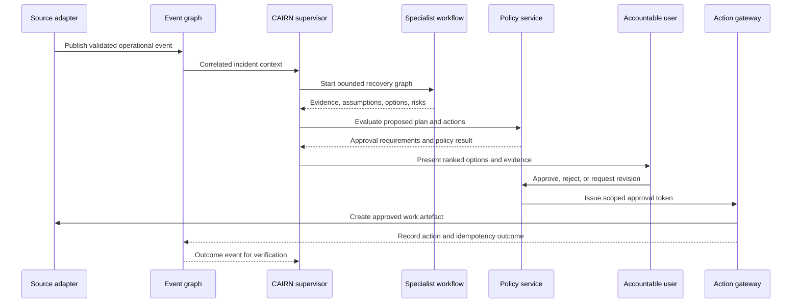

# 2. Target Architecture

## 2.1 Architectural position

CAIRN is an agentic decision layer between existing mine systems and accountable operational users. It does not replace dispatch, EAM/CMMS, SCADA, GIS, ERP, safety, or environmental systems. It creates a governed cross-system view and returns approved artefacts to those systems through explicit adapters.

The architecture follows TOGAF's separation of business, data, application, and technology concerns, with governance and requirements management treated as continuous controls. The TOGAF ADM is the method; the diagrams and contracts in this pack are the target-state building blocks.

## 2.2 System context

```mermaid
flowchart LR
    subgraph Sources[Mine and enterprise sources]
        Fleet[Fleet / dispatch]
        Plant[SCADA / historian / plant]
        EAM[EAM / CMMS]
        GIS[GIS / mine plan]
        HSE[Safety / permits / incidents]
        Env[Weather / water / environmental sensors]
        ERP[ERP / inventory / logistics]
    end

    Sources --> Ingest[Validated event and document adapters]
    Ingest --> Graph[Mine Event Graph + Evidence Fabric]
    Graph --> Orchestrator[CAIRN supervisor and bounded workflow]
    Orchestrator --> Agents[Specialist agents]
    Agents --> Policy[Policy, authorization, and approval service]
    Policy --> Actions[Action gateway]
    Actions --> Work[Work orders / shift plans / alerts / reports]
    Work --> Sources
    Orchestrator --> Audit[Audit, trace, evaluation, and outcome store]
    Policy --> Audit
    Actions --> Audit
    Users[Shift boss / planners / HSE / leaders] --> Orchestrator
    Users --> Policy
```



## 2.3 Logical architecture

### Layer 1 — Experience and decision views

- Situation room: current incidents, affected assets, constraints, and confidence.
- Scenario comparison: options, assumptions, impacts, and required approvals.
- Approval inbox: decision request, evidence, policy result, and explicit action.
- Shift handover: what changed, what remains unresolved, and who owns the next step.
- Audit view: event-to-decision-to-action-to-outcome trace.

### Layer 2 — Agentic decision services

| Component | Responsibility | Autonomy boundary |
|---|---|---|
| Supervisor | Classifies request, selects workflow, manages budgets, assembles final result | Cannot bypass policy or create side effects directly |
| Situation agent | Correlates events and builds current-state summary | Read-only |
| Reliability agent | Identifies equipment and maintenance constraints | Read-only; produces candidate work packages |
| Operations agent | Generates feasible shift/dispatch options | Read-only; no direct dispatch command |
| Risk and HSE agent | Checks hazards, controls, permits, and missing evidence | Can block recommendation; cannot waive control |
| Scenario agent | Compares options against typed objectives and constraints | Must expose assumptions and uncertainty |
| Action coordinator | Converts approved plan into tool calls | Requires approval token and idempotency key |
| Report agent | Produces shift brief, decision record, and stakeholder drafts | Cannot publish externally without approval |

### Layer 3 — Deterministic control services

- Identity and role resolution
- Policy decision point
- Approval and delegation service
- Tool registry and allow-list
- Input/output schema validation
- Idempotency and action ledger
- Rate, token, time, and cost budgets
- Evidence and citation resolver
- Audit and immutable event recording
- Evaluation harness and replay service

### Layer 4 — Operational data and integration

- Event adapters for synthetic fixtures first, vendor APIs later.
- Canonical mine event model.
- Evidence object store for raw payloads and documents.
- Transactional decision and approval store.
- Search/index layer for time, asset, location, and text retrieval.
- Optional graph projections for dependency and causal relationships.

### Layer 5 — Runtime and platform

- Python service hosting Strands agents.
- Amazon Bedrock model provider.
- Containerised API and worker processes.
- Event-driven ingestion and asynchronous workflow execution.
- Secrets, IAM roles, network controls, encryption, telemetry, and deployment pipeline.
- Amazon Bedrock AgentCore Runtime is a target hosting option; local execution remains the reference development mode.

## 2.4 Target AWS mapping

The following is a reference mapping, not a requirement to provision every service during the hackathon.

| Capability | Reference AWS building block | Prototype substitute |
|---|---|---|
| Agent inference | Amazon Bedrock | Bedrock model or configured local provider |
| Agent runtime | Amazon Bedrock AgentCore Runtime | Local Python process / Docker |
| Raw events and evidence | Amazon S3 | Local `fixtures/` and `artifacts/` |
| Event ingestion | Amazon EventBridge or Kinesis | In-process event replay |
| Transactional decisions | Amazon Aurora PostgreSQL or DynamoDB | SQLite/PostgreSQL fixture store |
| Search and retrieval | OpenSearch or a managed relational search index | Local keyword/vector adapter |
| Identity and permissions | IAM, Cognito/enterprise IdP | Local role fixtures |
| Secrets | Secrets Manager / Parameter Store | Environment variables for demo only |
| Observability | CloudWatch, X-Ray/OpenTelemetry | OpenTelemetry console/exporter |
| Async work | SQS / Step Functions / EventBridge | Local queue and bounded worker |

## 2.5 Data flow: disruption to decision



## 2.6 Canonical entities

The system of record for CAIRN's decision loop is the event/evidence/action chain, not the agent conversation.

- `Site`: mine, operation, region, timezone, operating calendar.
- `Asset`: equipment, plant, infrastructure, sensor, or logical capability.
- `Location`: pit, bench, route, plant area, work zone, or coordinate envelope.
- `OperationalEvent`: observed fact with source, time, location, asset, severity, and confidence.
- `Constraint`: capacity, availability, policy, permit, weather, resource, or schedule limitation.
- `Scenario`: proposed plan with assumptions, options, impacts, and confidence.
- `Decision`: approved/rejected/revised choice with actor and evidence.
- `Action`: idempotent side-effect request with approval, status, and outcome.
- `Evidence`: source reference, content hash, retrieval time, and access classification.

## 2.7 Deployment views

### Hackathon deployment

```text
Browser/UI → FastAPI → Strands supervisor → local bounded graph
                          ↓
                 synthetic adapters + local store
                          ↓
                    audit JSON + replay
```

### Enterprise target deployment

```text
Site edge / integration zone → validated event gateway → AWS data/event plane
                                                   ↓
                                   AgentCore / container runtime
                                                   ↓
                                 policy + approval + action gateway
                                                   ↓
                              enterprise systems and audit platform
```

The edge boundary should reduce exposure of OT systems. CAIRN receives explicitly approved data and returns explicitly approved artefacts; it is not a hidden route into the control network.

## 2.8 Quality attributes

| Attribute | Target design response |
|---|---|
| Safety | Tiered actions, policy gates, no direct OT control, explicit human ownership |
| Availability | Read-only degradation mode; stale-data indicators; replayable event stream |
| Traceability | Correlation ID, evidence IDs, prompt/model/policy versions, action ledger |
| Performance | Parallel specialist analysis with bounded graph timeouts |
| Security | Least privilege, role-scoped retrieval, encryption, secret isolation, prompt-injection controls |
| Portability | Adapter boundary; Strands provider abstraction; contract-first domain models |
| Changeability | Versioned schemas, prompts, policies, tools, models, and ADRs |
| Operability | OpenTelemetry spans, agent/tool metrics, dead-letter and retry handling |
