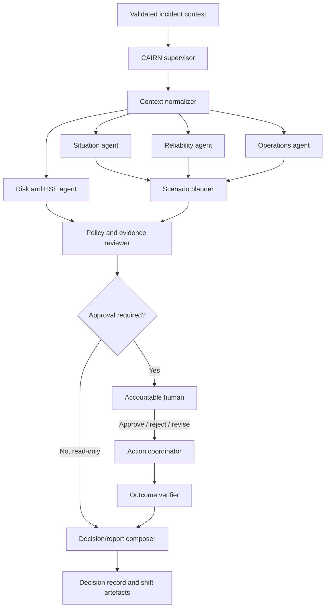

# 3. Strands Agent Design

## 3.1 Implementation choice

The first implementation uses the Python Strands Agents SDK with Amazon Bedrock as the model provider.

Reasons:

- Python is a strong fit for operational data adapters, validation, simulation, and evaluation tooling.
- Strands supports agents, structured output, hooks, multi-agent graphs, session managers, OpenTelemetry integration, and multiple model providers.
- Bedrock provides an AWS-native model boundary and can be replaced behind the Strands provider interface if required.
- The domain layer remains independent of Strands so the architecture is not coupled to prompts or SDK object shapes.

Strands is a library that runs inside the application process, not a complete control plane. CAIRN therefore supplies the missing enterprise concerns: identity, policies, action ledger, approvals, integration adapters, evidence, and operations.

References: [Strands overview](https://strandsagents.com/docs/user-guide/quickstart/overview/), [model providers](https://strandsagents.com/docs/user-guide/concepts/model-providers/), and [Bedrock provider](https://strandsagents.com/docs/user-guide/concepts/model-providers/amazon-bedrock/).

## 3.2 Agent topology

Use one bounded supervisor workflow rather than an unconstrained swarm.



## 3.3 Workflow nodes

| Node | Type | Input | Output | Must not do |
|---|---|---|---|---|
| `context_normalizer` | Deterministic function | Raw validated events | Normalized context | Interpret unknown values as facts |
| `situation_agent` | Strands agent | Normalized context + read tools | Current-state summary | Create or mutate actions |
| `reliability_agent` | Strands agent | Asset/maintenance context | Equipment constraints | Invent equipment state |
| `operations_agent` | Strands agent | Production and dispatch context | Feasible operating options | Issue dispatch commands |
| `risk_agent` | Strands agent | HSE, permit, weather, location context | Hazards, controls, missing evidence | Waive or downgrade controls |
| `scenario_planner` | Strands agent | Specialist outputs | Ranked scenarios | Hide assumptions or uncertainty |
| `policy_reviewer` | Deterministic service + optional agent | Scenario and policy context | Allow/deny/escalate result | Rely on model output as authorization |
| `action_coordinator` | Deterministic service | Approved scenario | Idempotent action requests | Execute without a valid approval token |
| `outcome_verifier` | Deterministic/agent hybrid | Action results + new events | Outcome and unresolved items | Mark success without evidence |
| `report_composer` | Structured-output agent | Full decision record | Shift brief and audit summary | Publish external communications |

## 3.4 Graph design rules

Use Strands `GraphBuilder` for the primary workflow. The graph should have explicit edges, a maximum execution count, an overall timeout, and per-node timeouts. Cycles are allowed only for a bounded revision loop after human feedback.

Recommended initial graph:

```text
normalize
  ├── situation
  ├── reliability
  ├── operations
  └── risk
        ↓
scenario_planner
        ↓
policy_reviewer
        ↓
approval / report
        ↓
action_coordinator → outcome_verifier
```

Do not allow the supervisor to dynamically create arbitrary tools, nodes, or edges in the first release. Dynamic orchestration can be evaluated later, but a high-consequence operational path must be inspectable and bounded.

The Strands Graph pattern supports dependency-based execution, parallelism, conditional edges, timeouts, maximum steps, nested workflows, and state management. See the [official Graph documentation](https://strandsagents.com/docs/user-guide/concepts/multi-agent/graph/).

## 3.5 Tool taxonomy

### Read tools

Read tools are safe by default but must still enforce authorization and data classification.

- `get_site_context`
- `get_asset_status`
- `get_recent_events`
- `get_maintenance_constraints`
- `get_weather_window`
- `get_active_permits`
- `get_production_constraints`
- `get_evidence`

### Proposal tools

Proposal tools produce artefacts without changing an external system.

- `simulate_recovery_plan`
- `check_spatial_temporal_conflicts`
- `calculate_production_impact`
- `draft_shift_instruction`
- `draft_work_order`
- `build_decision_record`

### State-changing tools

State-changing tools are called only by the action coordinator after external policy approval.

- `create_work_order`
- `publish_shift_instruction`
- `create_escalation`
- `send_internal_notification`
- `update_decision_status`

Every state-changing tool requires:

- `approvalToken`
- `idempotencyKey`
- `actorId`
- `tenantId` / `siteId`
- `policyDecisionId`
- `correlationId`
- `reason`
- typed payload and expected version

## 3.6 Strands lifecycle controls

Use Strands hooks as a control and telemetry surface, not as the only security boundary.

### Before invocation

- Resolve tenant, site, user, role, and correlation ID.
- Validate request shape and data classification.
- Load policy version and model configuration.
- Reject unsupported action scopes before model invocation.

### Before model call

- Redact secrets and prohibited fields.
- Attach the minimum context required for the node.
- Record prompt/template version and context identifiers.

### Before tool call

- Validate tool name against the node allow-list.
- Validate input schema and authorization.
- Block state-changing tools unless a policy decision permits them.
- Record a planned tool call before execution.

### After tool call

- Validate the external response as untrusted data.
- Record status, latency, response hash, and source reference.
- Convert failures into typed tool errors.
- Never let a tool response become an instruction to the model without delimiting and validation.

### After invocation

- Record final result, usage, cost estimate, outcome status, and unresolved items.
- Emit evaluation and audit events.
- Trigger a bounded resume only where the workflow explicitly permits it.

Strands exposes lifecycle hooks for invocation, model, tool, and multi-agent events. See the [Hooks documentation](https://strandsagents.com/docs/user-guide/concepts/agents/hooks/).

## 3.7 State and session rules

Separate three forms of state:

1. **Conversation history:** user-visible interaction context; not the authoritative operational record.
2. **Agent state:** small, non-sensitive, agent-local state such as counters or cached preferences.
3. **Invocation state:** request metadata such as correlation ID, site, user, policy version, and evidence references.

For the graph:

- Persist the orchestrator session, not separate independent histories for every specialist agent.
- Use a repository-backed session manager for multi-agent execution.
- Keep authoritative decisions, approvals, actions, and evidence in CAIRN stores, not only in Strands session state.
- Use immutable snapshots or replay fixtures for evaluation.

This follows Strands' session guidance: repository-based session management belongs on the multi-agent orchestrator, while agent state and invocation state serve different purposes. See [session management](https://strandsagents.com/docs/user-guide/concepts/agents/session-management/) and [state management](https://strandsagents.com/docs/user-guide/concepts/agents/state/).

## 3.8 Structured output

Agents must return typed objects at domain boundaries. Do not parse free-form prose to decide whether a plan is safe or executable.

Minimum structured outputs:

- `SituationSummary`
- `ConstraintSet`
- `ScenarioOption`
- `RiskFinding`
- `PolicyDecision`
- `ApprovalRequest`
- `ActionRequest`
- `OutcomeReport`

Each object should include:

- `schemaVersion`
- `correlationId`
- `evidenceIds`
- `assumptions`
- `confidence`
- `unknowns`
- `createdAt`
- `producer`

## 3.9 Prompt boundaries

Each specialist prompt should define:

- Role and decision scope.
- Inputs it is allowed to use.
- Tools it is allowed to call.
- Required output schema.
- Safety and uncertainty rules.
- Escalation conditions.
- Prohibited actions.

Prompt text is versioned like code. A model must not be trusted to infer authorization from a prompt; the policy service remains authoritative.

## 3.10 Failure handling

- At-least-once event processing; tools must be idempotent.
- Bounded retries with exponential backoff for transient dependencies.
- Dead-letter queue or failed-run record for non-retryable events.
- Explicit `UNKNOWN` outcome when an external call times out after it may have applied.
- No automatic retry of a state-changing action without the same idempotency key.
- Read-only degraded mode when a source is stale or a policy service is unavailable.
- Human escalation when evidence is incomplete, conflicting, or outside the agent's scope.
